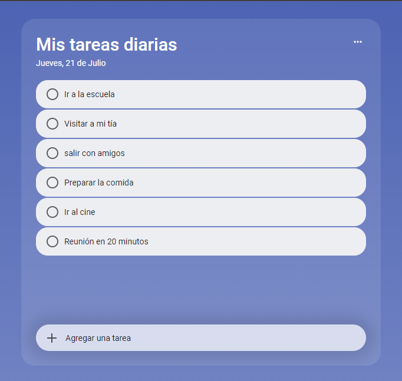

<div align="center">
  
  
  
  
  
  <br />

  <h2 align="center">Daily Tasks, a fully responsive todo app - By: Josue Fischer</h2>

  Responsive for all devices, built using HTML, CSS, and JavaScript.

  <a href="https://josuefischeroficial.github.io/daily-tasks/"><strong>➥ Live Demo</strong></a>

</div>

<br />
  
### Demo Screenshot



### Prerequisites

Before you begin, ensure you have met the following requirements:

* [Git](https://git-scm.com/downloads "Download Git") must be installed on your operating system.

### Run Locally

To run **Daily Tasks** locally, run this command on your git bash:

Linux and macOS:

```bash
sudo git clone https://github.com/josuefischeroficial/daily-tasks.git
```

Windows:

```bash
git clone https://github.com/josuefischeroficial/daily-tasks.git
```

### Contact

If you want to contact with me you can reach me at [E-mail](mailto:josuefischercraft@gmail.com).

### License

This project contains an **MIT License.**